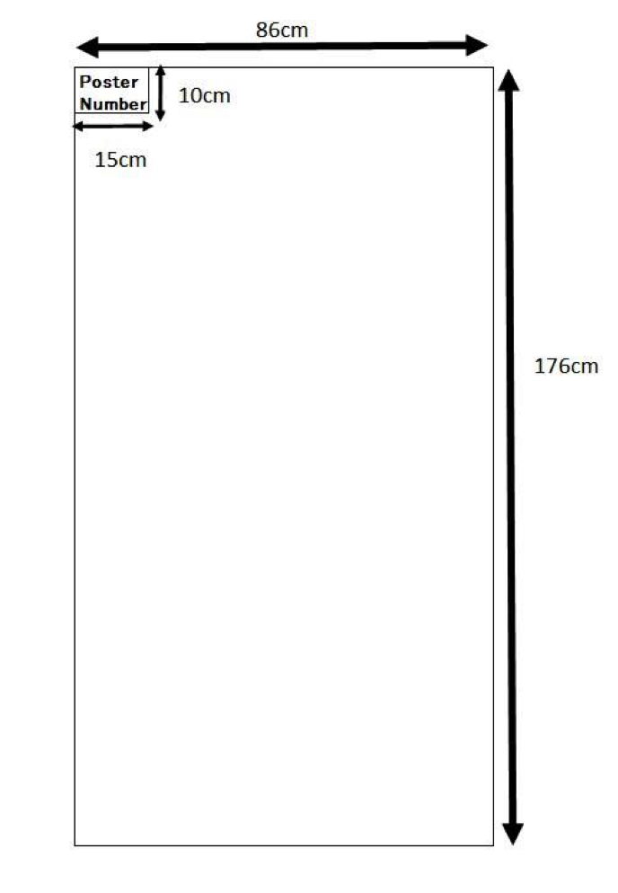

<!-- MAIN CONTENT -->

  <section id="main_content" class="inner">
  <h3>For the presenters of the poster session</h3>
  

    

      <u>Poster Session (Odd numbers)</u>
       
        &nbsp;&nbsp;&nbsp;Day 1 (August 24, Wednesday. Poster session: 14:00 to 16:00) 
        &nbsp;&nbsp;&nbsp;&nbsp;&nbsp;Please make sure your poster is up/removed according to the following time: 
        &nbsp;&nbsp;&nbsp;&nbsp;&nbsp;&nbsp;&nbsp;&nbsp;- Poster placement (Odd numbers) during registration 9:00am-9:30am 
        &nbsp;&nbsp;&nbsp;&nbsp;&nbsp;&nbsp;&nbsp;&nbsp;- Poster removal during Session 2 coffee break or before Workshop dinner 
       
        <u>Poster Session (Even numbers)</u>
         
        &nbsp;&nbsp;&nbsp;Day 2 (August 25, Thursday. Poster session: 16:35 to 18:30) 
        &nbsp;&nbsp;&nbsp;&nbsp;&nbsp;Please make sure your poster is up/removed according to the following time: 
        &nbsp;&nbsp;&nbsp;&nbsp;&nbsp;&nbsp;&nbsp;&nbsp;- Poster placement (Even numbers) during registration 8:30am-9:00am 
        &nbsp;&nbsp;&nbsp;&nbsp;&nbsp;&nbsp;&nbsp;&nbsp;- Poster removal after poster session 
    

    <ul>
      <li>
        Please register at the reception prior to setting up your poster.
      </li> 
      <li>
        Put up your poster where assigned, which will be indicated in the information desk.
      </li> 
      <li>
        Please stand by your poster for presentation and discussion during your session.
      </li> 
      <li>
        Please prepare a powerpoint slide to describe your poster and copy it to 
        the presentation computer before the start of the session of your lightning talk.
      </li>
    </ul> 

    
Note
       
        Thumbtacks and your number card (see figure below;place it on the top left of your poster) will be provided as follows.
        
      
    

  
  

  <h3>For the presenters of the bioinformatics hands-on session</h3>
  

    

      The Hands-on session will be held in Seminar Room 2, across the hall from the main auditorium.  
      Each presenter will be assigned a section of the room with tables to set up their computer and any other materials.
    

    

      <u>Hands-on session</u>
       
        &nbsp;&nbsp;&nbsp;Day 2 (August 25, Thursday. 16:35 to 18:30) 
    

    <ul>
      <li>
        Please register at the reception prior to setting up your table.
      </li> 
      <li>
        Set up your computer where assigned, which will be indicated in the information desk.
      </li> 
      <li>
        Please be at your table for presentation and discussion during your session.
      </li> 
      <li>
        No projector will be available, but power cables will be provided.
      </li>
      <li>
        Please prepare a powerpoint slide to describe your software or database and copy it to 
        the presentation computer before the start of thesession of your lightning talk.
      </li>
    </ul> 
  

  </section>

